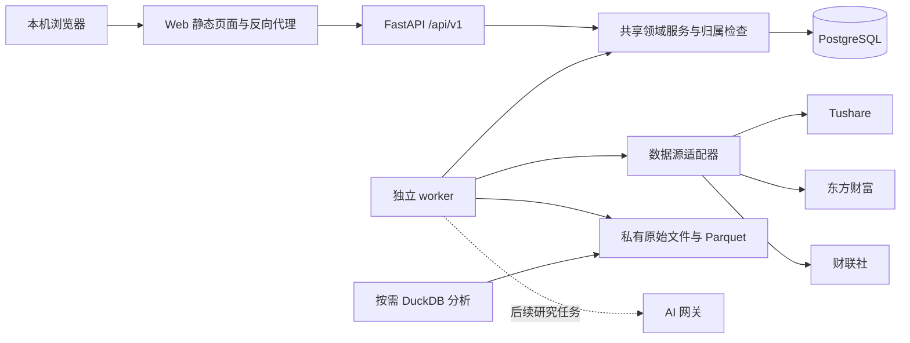

# 架构设计

状态：阶段 0 设计确定，尚未实现运行服务。本文约束后续模块开发，不提供当前可执行的启动命令。总体进度见 [项目方案](project-plan.md) 与 [阶段路线](roadmap.md)。

## 技术基线

| 层 | 选型 | 职责 |
| --- | --- | --- |
| 桌面渲染层 | React、TypeScript、Vite、React Router，运行于 Electron Windows EXE | 当前产品入口；浏览器仅供开发/视觉调试 |
| 组件与请求 | Ant Design、TanStack Query | 常规交互、服务器状态、加载和错误展示 |
| 图表 | ECharts | 行情、时间序列、资金与回放可视化 |
| API | Python、FastAPI、Pydantic | `/api/v1` 接口、校验、归属检查 |
| 持久层 | PostgreSQL、SQLAlchemy、Alembic | 长期记录、任务和显式版本迁移 |
| 后台执行 | 独立 Python worker、PostgreSQL 任务表 | 采集、计算、补缺、报告任务 |
| 批量分析 | pandas、Parquet、DuckDB | 按需分析与可重建的数据集产物 |
| 部署 | Docker Compose 基线 | web、api、worker、postgres 独立服务 |

阶段 0 不创建业务代码、实际 Compose 文件或已实现的目录脚手架。下一项本体任务只规划[最小应用骨架](modules/application-skeleton.md)，随后按用户选定模块建立业务服务、worker 和适配器。未选模块不建业务表、不部署采集/导入任务；数据中心随已启用模块增长，不先做全数据平台。避免再把全部页面放入一个组件、把全部接口放入一个文件，或把个人 Skill 脚本变成运行时架构。

下图描述长期服务关系，骨架只实现前后端、独立 PG、配置健康、空工作台与部署。worker、三类来源适配、私有数据产物及 AI 并非骨架必建服务。数据库结构升级由显式 Alembic 管理，与可选旧数据导入分开，见 [ADR 0006](adr/0006-module-first-new-project.md)。

## 服务关系

- 网页和未来研究 Agent 通过领域服务读取已入库数据，不直接请求外部数据源。API 的普通读取不能暗中执行采集或付费 AI 工作；刷新通过显式任务入口提交。
- API 和 worker 复用数据契约、归属策略、计算服务与适配器。长任务留在 worker，API 返回任务标识与状态；具体任务接口随已选模块需求实现。
- PostgreSQL 保存标准化事实、用户记录、来源关系、计算版本、任务实例和运行状态。原始材料与批量文件放独立私有数据目录，由数据库登记引用、摘要、时间和校验信息。
- DuckDB 读取分析副本或 Parquet，不替代 PostgreSQL 作为用户记录和任务状态的主库。Parquet 是显式版本的数据集产物，不能悄然成为另一套未登记事实源。

## 数据、身份和时间边界

直接数据、派生结果与 AI 解读分层保存，引用上游输入和版本。来源名、文件哈希、多个 Agent 的一致意见只能帮助追踪，不能证明内容真实。保留缺失、冲突、失败和过期状态，完整规则见 [接口契约](contracts.md)。

首期为独立部署的本机单用户应用，服务端身份上下文固定 `user_id=local`、`workspace_id=local`。个人股票池、提醒、标记、配置、报告、任务和文件均须由后端按归属访问。客户端不能通过传入任意身份改变归属；后台任务必须携带创建时的身份上下文，不能绕开同一边界。

公共市场事实与用户私有资产分别组织。部署内部的共享数据不意味着向外共享，也不意味着可以在不同凭据、查询范围或部署之间复用私有缓存。文件下载、任务状态与缓存键同样纳入访问边界。

首期没有登录认证，只允许本机访问；`local` 是数据隔离约束，不能作为互联网访问控制。开放局域网、公网或多用户前，必须先增加认证、成员权限、凭据与任务隔离，以及跨用户行为测试。手机布局可阅读，但阶段 0 不因此开放网络访问。

数据库时间使用可表达时区的时间类型；API 输出带偏移的 ISO 8601，界面使用 `Asia/Shanghai`。交易日与盘中时段由交易日历决定，不以周一至周五替代。区分事件时点、系统观察时点和可用于研究的时点；历史研究按可得时间截止，具体含义见契约。

## 任务与存储生命周期

- API 提交任务、worker 领取执行。任务登记归属、类型、参数引用、依赖、状态、尝试次数与执行时间；采用数据库原子领取和 lease。每次领取生成递增 generation/fencing token；续租、状态更新和正式数据发布在事务中检查当前 token 与租约，过期 worker 恢复后不得覆盖新 worker 的成果。外部请求可能重复，正式写入仍须业务键幂等。
- 确定性写入按业务键幂等；失败记录错误并保留既有有效数据。网络重试须受次数与频率限制，外部权限或字段口径错误不得无限重试。
- 调度依据明确的交易日与时间窗。进程退出后可定位未完成实例；lease 超时不能直接宣称任务未产生任何副作用，重跑先检查已写成果。
- 使用显式 Alembic 迁移；导入应用、启动普通查询或打开页面不隐式建表、修复旧库或迁移资产。
- 长期数据保留不等于每秒快照永久堆积。模块实现时确定数据粒度、留存和压缩；保留研究所需事实与证据，清理缓存不删除用户资产。数据库与文件登记一起备份，并验证恢复后引用一致。

## 本地部署与演进

| 入口 | 基线 | 说明 |
| --- | --- | --- |
| Web | `127.0.0.1:8080` | 本地正式入口，同源代理 `/api/v1` |
| API | `127.0.0.1:8140` | 原生本地开发与诊断；Compose 仅内部网络 |
| Vite | `127.0.0.1:5180` | 后续开发服务，代理到新版 API |
| PostgreSQL | 容器网络 `5432` | 默认不映射主机端口 |

服务端口、数据库、私有数据目录、配置、worker 和调度均与旧项目独立。旧项目只有用户主动发起的本地只读迁移能访问；不成为 API、worker、DuckDB 或页面的正常运行依赖。导入排除和血缘判断见 [迁移设计](data/migration.md)。

Compose 默认只映射 Web 到本机，不映射 API 或数据库。后续开发模式才启动本机 API/Vite，CORS 仅开放实际开发来源。

配置与密钥规则见 [配置说明](configuration.md)；AI 接入和角色协作见 [产品 Agent 设计](agents.md)。先完成独立骨架与用户选定的常规研究模块，再增加可审计研究工作流、回测、模拟执行；真实交易执行单独设计授权、风控、订单状态与恢复，不由前期 API 顺带提供。

## 后续验收边界

下列任务、数据血缘和 worker 验收在对应模块启用时适用；骨架不承担采集、导入或完整任务平台验收。新采集足够即可交付功能，默认不迁移旧数据，迁移评估不是执行授权。

- 干净部署无需旧项目、个人路径或开发工具内置运行时；不配置数据源或 AI 时仍可诊断缺配置。
- 同一读取结果能定位事实、来源和时间；重复任务不会重复写入，失败不会清空历史有效记录。
- worker 租约过期并被重新领取后，旧执行者恢复时的续租、正式写入与完成状态更新都被拒绝；新执行者的结果保留。
- API、worker、文件和缓存均拒绝跨归属访问；未来认证方案上线前不开放远程访问。
- 实际 Compose、迁移、备份恢复和 worker 故障恢复通过后，才把对应能力标为已实现。

## Windows 免安装应用补充（ADR 0007）

当前产品是 Windows x64 portable/onedir EXE：解压后双击程序，程序资源、用户研究数据、下载更新包和缓存分目录，不要求 Node、Python、Docker、PostgreSQL 或管理员权限。React/TypeScript/Vite 渲染层运行在 Electron 桌面壳内；浏览器运行仅供开发与视觉调试，不构成独立 Web 产品。Tauri 2 的资源对比属于后续优化研究，不是本轮交付前提。

单用户免安装存储优先评估 SQLite WAL + SQLAlchemy/Alembic；WAL checkpoint、busy 重试、备份一致性和故障恢复仍需实现和验收。Parquet/DuckDB 仅作为按需批量分析产物，嵌入式写入由单个后台进程持有；不在本轮建立业务表或导入数据。PostgreSQL、Docker Compose 和多用户服务保留未来服务器部署方案，不能成为桌面首包启动前提。Python 生态保留给未来金融计算、采集和量化模块；空白 UI 不等待不存在的服务。

Runtime 自动更新器本轮未实现。未来版本若接入，只能消费受信 GitHub Release 元数据和 Windows 资产，进行 SemVer/prerelease 筛选、完整性/真实性校验、原子切换、回退和用户确认；渲染器无 Node/秘密，主进程 IPC 受控。
